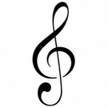

 

> **The art of preserving music.**
> The professional environment for music notation and engraving. Transcribe, catalog, and preserve your repertoire with absolute precision.

 

🌍 **Read this in other languages:** <a href="#english">English</a> | <a href="#español">Español</a>

 

 

###  The Origin Story
I just wanted to learn how to play the piano. But instead of actually practicing, I got frustrated searching for ugly, poorly scanned sheet music with completely different aesthetics all over the internet.

So, like anyone with their priorities "straight", I decided to postpone my musical journey to code my own browser-based sheet music editor and catalog from scratch. Maybe I should close my code editor, sit at the keyboard, and finally start practicing... but hey, at least my sheet music looks incredible now.

> **🤖 Transparency Note (or "How I built this without being a Frontend Guru")**
> If you inspect the codebase and think: *"wow, this guy breathes JavaScript"*, let me stop you right there. My natural habitat is math. This project is the result of a lot of *vibe coding*: I designed the modular architecture, provided the mathematical logic so the measures wouldn't explode, and made the core product decisions; my AI assistant took care of typing out most of the syntax. It turns out that if you have a clear logic of what you want to build and know *how* to ask for it, you can create a full-fledged sheet music editor without having to search StackOverflow on how to center a div for the millionth time.

---

##  Technical Features

Built without any UI framework, as a set of vanilla ES Modules. The project demonstrates strong web fundamentals, focusing on performance, state management, and complex DOM/SVG manipulation.

* **Algorithmic Engraving (VexFlow):** Deep integration with the VexFlow engine to dynamically calculate and render complex grand-staff notation, including strict dotted-note math, key/time signatures, repeats, directives (Fine, D.C. al Coda...), fingering, lyrics, and automatic beaming.
* **Interactive Practice Mode:** A microphone-enabled learning tool. It uses an AutoCorrelate algorithm to perform real-time pitch detection, listening as you play on a real acoustic instrument and tracking your progress across the score.
* **The Codex (Public Global Catalog):** A social repository where users can publish their transcriptions. Browse the community's public library, inspect scores, and clone them directly to your personal catalog.
* **Playback Engine (Tone.js):** A sampled acoustic piano plays back the transcribed score in sync with the notation — adjustable tempo (BPM) and playback speed, live progress bar, and a sweep line synced flawlessly to the UI's frame-rate.
* **Local-First Storage & Cloud Sync:** Scores are saved instantly to the browser's `localStorage` (fully offline). Connecting a free account (Firebase Auth) securely syncs your private catalog to Firestore in real time. 
* **Custom Print Engine:** Uses advanced `@media print` CSS to hijack the browser's native print dialogue. It strips the UI, formats the SVG canvas into exact A4 pages, and injects custom headers/footers for a flawless PDF export.
* **Vanilla SPA Architecture:** Hash-based URL routing, a Singleton EventBus pattern to decouple modules, State Proxies to prevent unwanted mutations, and real-time DOM filtering/sorting.

##  Live Demo

Access the live tool hosted on GitHub Pages:
**[https://manusantos-dev.github.io/ebony-and-ivory/](https://manusantos-dev.github.io/ebony-and-ivory/)**

##  Feedback & Support

This is a completely open-source tool made *by* a music lover, *for* musicians and anyone who simply enjoys playing. I don't want to monetize this with ads or paywalls. 

**The only thing I ask for in return is your feedback.**
Have you found a bug? Is there a feature you desperately miss? Do you just want to share how you're using it? Please open an issue on GitHub or reach out to me. Let's make this tool better together!

##  Disclaimer & Copyright

Ebony & Ivory is an open-source personal tool. The musical works you transcribe remain the property of their respective original authors. Please transcribe responsibly.

---

  <em>Created with passion for design, clean code, and music (even if it's just an excuse not to practice).</em>

   

  
<h1 id="español"></h1>

> **El arte de preservar la música.**
> El entorno profesional para la notación y el grabado musical. Transcribe, clasifica y eterniza tu repertorio con precisión absoluta.

🌍 **Leer en otros idiomas:** <a href="#english">English</a> | <a href="#español">Español</a>

 

###  La verdadera historia
Yo solo quería aprender a tocar el piano. Pero en lugar de ponerme a practicar, me frustré buscando partituras feas, mal escaneadas y con estéticas completamente distintas por todo internet.

Así que, como cualquier persona con sus prioridades "claras", decidí posponer mi aprendizaje musical para programar mi propio editor y gestor de partituras en el navegador desde cero. Quizás debería cerrar el editor de código, sentarme frente al teclado y ponerme a practicar de una vez por todas... pero oye, al menos ahora mis partituras lucen increíbles.

> **🤖 Nota de transparencia (o "Cómo construí esto sin ser un gurú del Frontend")**
> Si inspeccionas el código y piensas: *"wow, este chico respira JavaScript"*, te detengo ahí mismo. Mi hábitat natural son las matemáticas. Este proyecto es el resultado de mucho *vibe coding*: yo diseñé la arquitectura modular, aporté la lógica matemática para que los compases no exploten y tomé las decisiones de producto; mi asistente de Inteligencia Artificial se encargó de teclear la mayor parte de la sintaxis. Resulta que si tienes clara la lógica de lo que quieres construir y sabes *cómo* pedirlo, puedes crear un editor musical completo sin tener que buscar en StackOverflow cómo centrar un div por enésima vez.

---

##  Características Técnicas

Construido sin ningún *framework* de UI, como un conjunto de módulos ES (ES Modules) en JavaScript puro. El proyecto demuestra fundamentos sólidos de desarrollo web, enfocándose en el rendimiento, la gestión del estado y la manipulación compleja del DOM/SVG.

* **Grabado Algorítmico (VexFlow):** Integración profunda con el motor VexFlow para calcular y dibujar dinámicamente notación musical compleja en sistema de piano completo. Soporta matemáticas de puntillos, digitación, inserción de letras, repeticiones e indicaciones (Fine, D.C. al Coda...) con beaming automático.
* **Modo Práctica Interactivo:** Una herramienta de aprendizaje habilitada para micrófono. Utiliza un algoritmo AutoCorrelate para detectar el tono de tu instrumento acústico en tiempo real, permitiendo avanzar la partitura mientras la tocas.
* **El Códice (Catálogo Público Global):** Un repositorio social donde los usuarios pueden publicar y compartir sus obras. Explora la biblioteca pública de la comunidad y clona obras directamente a tu catálogo personal.
* **Motor de Reproducción (Tone.js):** Un piano acústico muestreado reproduce la partitura en sincronía con la notación — tempo (BPM) y velocidad ajustables, atajos de copia/pega de compases, pila de deshacer/rehacer y una "línea mágica" sincronizada a nivel de frame.
* **Almacenamiento Local con Sync en la Nube:** Las partituras se guardan al instante en el `localStorage` (100% offline). Conectar una cuenta gratuita (vía Firebase) sincroniza tu catálogo de forma segura con Firestore en tiempo real entre dispositivos.
* **SPA de Arquitectura Vanilla:** Enrutamiento de URLs mediante Hash, un patrón de EventBus (Singleton) para desacoplar módulos, Proxies de estado para prevenir mutaciones indeseadas y filtrado del DOM en tiempo real.

##  Live Demo

Accede a la herramienta en vivo alojada en GitHub Pages:
**[https://manusantos-dev.github.io/ebony-and-ivory/](https://manusantos-dev.github.io/ebony-and-ivory/)**

##  Feedback y Contribuciones

Esta es una herramienta de código abierto hecha *por* un aficionado a la música *para* músicos y cualquiera que disfrute tocando. No tengo intención de monetizarla con anuncios ni versiones de pago.

**Lo único que me gustaría recibir a cambio es vuestro *feedback*.**
¿Has encontrado un fallo? ¿Echas en falta alguna funcionalidad? ¿O simplemente quieres contarme qué te parece? Por favor, abre un *issue* en GitHub o escríbeme directamente. ¡Ayúdame a mejorarla!

##  Aviso Legal y Copyright

Ebony & Ivory es una herramienta de uso personal. Las obras musicales que transcribas siguen siendo propiedad de sus respectivos autores originales. Por favor, transcribe con responsabilidad.

---

  <em>Creado con pasión por el diseño, el código limpio y la música (aunque sea una excusa para no practicar).</em>

