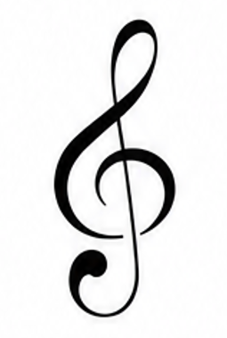

 

> **The art of preserving music.**
> A digital canvas to transcribe, play, classify, and immortalize your sheet music with unmatched elegance.

 

🌍 **Read this in other languages:** <a href="#english">English</a> | <a href="#español">Español</a>

 

 

###  The Origin Story
I just wanted to learn how to play the piano. But instead of actually practicing, I got frustrated searching for ugly, poorly scanned sheet music with completely different aesthetics all over the internet.

So, like anyone with their priorities "straight", I decided to postpone my musical journey to code my own sheet music editor and manager from scratch. Maybe I should close my code editor, sit at the keyboard, and finally start practicing... but hey, at least my sheet music looks incredible now.

---

##  Technical Features

Built without any UI framework, as a set of vanilla ES Modules. The project demonstrates strong web fundamentals, focusing on performance, state management, and complex DOM/SVG manipulation.

* **Algorithmic Engraving (VexFlow):** Deep integration with the VexFlow engine to dynamically calculate and render complex grand-staff notation, including strict dotted-note math, key/time signatures, repeats, directives (Fine, D.C. al Coda...) and automatic beaming.
* **Playback Engine (Tone.js):** A sampled acoustic piano plays back the transcribed score in sync with the notation — adjustable tempo (BPM) and playback speed (0.5× to 2×), live progress bar, and a "magic line" that sweeps across the active measure while the corresponding notes light up.
* **Local-First Storage with Optional Cloud Sync:** Scores are saved instantly to the browser's `localStorage`, so the app works fully offline with zero setup. Creating a free account (email/password or Google, via Firebase Authentication) additionally syncs your catalog to Firestore in real time across devices; local data is purged on sign-out for privacy. JSON export/import is also available for manual backups.
* **Custom Print Engine:** Uses advanced `@media print` CSS to hijack the browser's native print dialogue. It strips the UI, formats the SVG canvas into exact A4 pages (4 measures per line), and injects custom headers/footers for a flawless PDF export.
* **Native i18n Implementation:** A custom bilingual system (EN/ES) that auto-detects the user's `navigator.language` on load and toggles the entire UI state instantly without page reloads.
* **Vanilla State Management:** Hash-based URL routing (`#catalogo`, `#editor/id`, `#viewer/id`, `#ejemplo`), a tiny pub/sub event bus to decouple modules, and real-time DOM filtering/sorting (including custom UI dropdowns for US/EU key-signature notation), simulating a Single Page Application (SPA) experience using only vanilla JS.
* **Modular Architecture:** The app is split into focused ES Modules (state, events, i18n, storage, notation rendering, audio player, auth/cloud sync...) wired together from a single entry point, instead of one monolithic script.

##  Live Demo

Access the live tool hosted on GitHub Pages:
**[https://manusantos-dev.github.io/ebony-and-ivory/](https://manusantos-dev.github.io/ebony-and-ivory/)**

##  Disclaimer & Copyright

Ebony & Ivory is an open-source personal tool. The musical works you transcribe remain the property of their respective original authors. Please transcribe responsibly.

---
   

  
<h1 id="español"></h1>

> **El arte de preservar la música.**
> Un lienzo digital para transcribir, reproducir, clasificar y eternizar tus partituras con una elegancia inigualable.

🌍 **Leer en otros idiomas:** <a href="#english">English</a> | <a href="#español">Español</a>

 

###  La verdadera historia
Yo solo quería aprender a tocar el piano. Pero en lugar de ponerme a practicar, me frustré buscando partituras feas, mal escaneadas y con estéticas completamente distintas por todo internet.

Así que, como cualquier persona con sus prioridades "claras", decidí posponer mi aprendizaje musical para programar mi propio editor y gestor de partituras desde cero. Quizás debería cerrar el editor de código, sentarme frente al teclado y ponerme a practicar de una vez por todas... pero oye, al menos ahora mis partituras lucen increíbles.

---

##  Características Técnicas

Construido sin ningún *framework* de UI, como un conjunto de módulos ES (ES Modules) en JavaScript puro. El proyecto demuestra fundamentos sólidos de desarrollo web, enfocándose en el rendimiento, la gestión del estado y la manipulación compleja del DOM/SVG.

* **Renderizado Algorítmico (VexFlow):** Integración profunda con el motor VexFlow para calcular y dibujar dinámicamente notación musical compleja en sistema de piano completo, incluyendo inserción matemática estricta de puntillos, armaduras, repeticiones e indicaciones (Fine, D.C. al Coda...) con beaming automático.
* **Motor de Reproducción (Tone.js):** Un piano acústico muestreado reproduce la partitura transcrita en sincronía con la notación — tempo (BPM) y velocidad de reproducción ajustables (de 0.5× a 2×), barra de progreso en tiempo real y una "línea mágica" que recorre el compás activo mientras se iluminan las notas correspondientes.
* **Almacenamiento Local con Sincronización en la Nube Opcional:** Las partituras se guardan al instante en el `localStorage` del navegador, por lo que la app funciona completamente offline sin configuración alguna. Crear una cuenta gratuita (email/contraseña o Google, vía Firebase Authentication) sincroniza además tu catálogo con Firestore en tiempo real entre dispositivos; los datos locales se purgan al cerrar sesión por privacidad. También se puede exportar/importar en JSON para copias de seguridad manuales.
* **Motor de Impresión Custom:** Emplea CSS avanzado (`@media print`) para transformar el lienzo web en hojas A4 perfectas. Oculta la interfaz, fuerza una maquetación algorítmica de exactamente 4 compases por línea e inyecta encabezados y paginación personalizados.
* **Implementación i18n Nativa:** Un sistema bilingüe (EN/ES) construido desde cero que autodetecta el `navigator.language` del usuario al entrar y permite cambiar el idioma de toda la interfaz en tiempo real sin recargar.
* **Gestión de Estado Vanilla:** Enrutamiento de URLs mediante Hash (`#catalogo`, `#editor/id`, `#viewer/id`, `#ejemplo`), un pequeño bus de eventos pub/sub para desacoplar los módulos, y algoritmos de filtrado/ordenación en el DOM en tiempo real (incluyendo desplegables personalizados para notación de tonalidades US/EU), simulando la fluidez de una *Single Page Application* (SPA) usando únicamente JavaScript puro.
* **Arquitectura Modular:** La aplicación está dividida en módulos ES con responsabilidad única (estado, eventos, i18n, almacenamiento, renderizado de notación, reproductor de audio, autenticación/sincronización...) conectados desde un único punto de entrada, en lugar de un script monolítico.

##  Live Demo

Accede a la herramienta en vivo alojada en GitHub Pages:
**[https://manusantos-dev.github.io/ebony-and-ivory/](https://manusantos-dev.github.io/ebony-and-ivory/)**

##  Aviso Legal y Copyright

Ebony & Ivory es una herramienta de código abierto. Las obras musicales que transcribas siguen siendo propiedad de sus respectivos autores originales. Por favor, transcribe con responsabilidad.

---

  <em>Creado con pasión por el diseño, el código limpio y la música (aunque sea una excusa para no practicar).</em>

